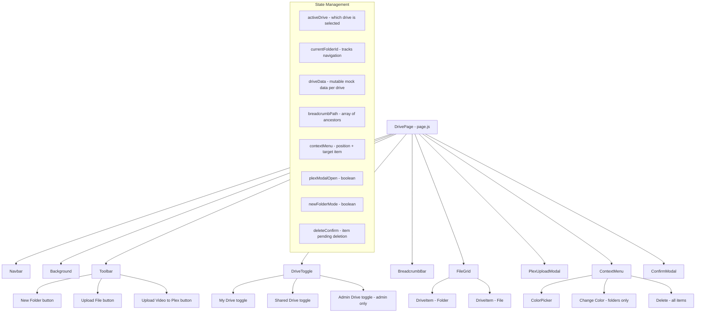

# Design Document: Drive File Browser

## Overview

The Drive File Browser replaces the current project-card-based Drive page with a Google Drive-like file browsing interface. Users can navigate a folder hierarchy, create folders, upload files, customize folder colors, and upload videos to Plex via a dedicated modal.

The page now supports multiple drives (My Drive, Shared Drive, Admin Drive) via toggle tabs, with Admin Drive restricted to admin users via AuthContext. Users can also delete files and folders through a right-click context menu with a confirmation modal.

The implementation is frontend-only for now, using in-component mock data. The architecture is designed so mock data can be swapped for API calls later without changing component logic. All new components follow the existing patterns: Next.js App Router with `"use client"`, React hooks for state, CSS Modules for styling, and the Tron Ares visual theme.

## Architecture



The page component (`page.js`) owns all state and passes it down as props. There is no global state management needed — `useState` hooks in the page component are sufficient. AuthContext is consumed via `useAuth()` to determine admin status for the Drive Toggle.

## Components and Interfaces

### 1. DrivePage (page.js)

The root page component. Owns all state: the drive data (per drive), active drive, current folder ID, breadcrumb path, context menu state, plex modal visibility, new folder input mode, and delete confirmation state.

```jsx
// State
const { isAdmin } = useAuth();
const [driveDataMap, setDriveDataMap] = useState({
  myDrive: MOCK_MY_DRIVE_DATA,
  sharedDrive: MOCK_SHARED_DRIVE_DATA,
  adminDrive: MOCK_ADMIN_DRIVE_DATA,
});
const [activeDrive, setActiveDrive] = useState("myDrive");
const [currentFolderId, setCurrentFolderId] = useState("root");
const [breadcrumbPath, setBreadcrumbPath] = useState([{ id: "root", name: "My Drive" }]);
const [contextMenu, setContextMenu] = useState(null); // { x, y, itemId }
const [showColorPicker, setShowColorPicker] = useState(false);
const [plexModalOpen, setPlexModalOpen] = useState(false);
const [newFolderMode, setNewFolderMode] = useState(false);
const [deleteConfirm, setDeleteConfirm] = useState(null); // { itemId, itemName }
```

The active drive's data is accessed via `driveDataMap[activeDrive]`. All existing functions (navigateToFolder, createFolder, handleFileUpload, changeFolderColor, getCurrentItems) operate on the active drive's data slice.

Key new/modified functions:
- `switchDrive(driveKey)` — sets activeDrive, resets currentFolderId to "root", rebuilds breadcrumb for the new drive's root
- `handleContextMenu(event, itemId)` — now shows context menu for both folders and files (not just folders)
- `deleteItem(itemId)` — opens the confirmation modal with the item's name
- `confirmDelete()` — removes the item (and all descendants if folder) from the active drive's data, removes its ID from the parent's children array, closes the modal
- `cancelDelete()` — closes the confirmation modal without changes

### 2. DriveToggle (new component)

A row of toggle buttons rendered below the Toolbar, following the same pattern as TaskToggle.

```
Props:
  activeDrive: string ("myDrive" | "sharedDrive" | "adminDrive")
  onDriveChange: (driveKey: string) => void
  showAdminDrive: boolean
```

Renders toggle buttons for each drive. When `showAdminDrive` is false, the "Admin Drive" button is not rendered. Uses the same styling pattern as TaskToggle: active button has red background with black text, inactive buttons have black background with red text and reduced opacity, orange hover glow on inactive buttons.

Drive labels mapping:
- `myDrive` → "My Drive"
- `sharedDrive` → "Shared Drive"
- `adminDrive` → "Admin Drive"

### 3. Toolbar (existing - unchanged)

Action bar rendered above the file grid. No changes needed.

```
Props:
  onNewFolder: () => void
  onUploadFile: () => void
  onPlexUpload: () => void
```

### 4. BreadcrumbBar (existing - unchanged)

Displays the navigation path as clickable segments separated by " > ". No changes needed.

```
Props:
  path: Array<{ id: string, name: string }>
  onNavigate: (folderId: string) => void
```

### 5. FileGrid (existing - unchanged)

Renders the list of Drive_Items for the current folder. No changes needed.

```
Props:
  items: Array<DriveItem>
  onFolderClick: (folderId: string) => void
  onContextMenu: (event, itemId: string) => void
  newFolderMode: boolean
  onNewFolderSubmit: (name: string) => void
  onNewFolderCancel: () => void
```

### 6. DriveItemCard (existing - unchanged)

Renders a single file or folder as a card with an icon and name. No changes needed.

### 7. ContextMenu (existing - modified)

The context menu now shows different options depending on the item type:
- For folders: "Change Color" and "Delete"
- For files: "Delete" only

```
Props:
  x: number
  y: number
  itemType: "folder" | "file"
  onChangeColor: () => void
  onDelete: () => void
  onClose: () => void
```

The `onChangeColor` handler is only rendered when `itemType === "folder"`. The `onDelete` handler is always rendered.

### 8. ColorPicker (existing - unchanged)

A small panel of predefined color swatches. No changes needed.

### 9. PlexUploadModal (existing - unchanged)

Modal for uploading video to Plex. No changes needed.

### 10. ConfirmModal (new component)

A confirmation dialog for destructive actions (deletion). Follows the Tron Ares modal styling pattern.

```
Props:
  isOpen: boolean
  itemName: string
  onConfirm: () => void
  onCancel: () => void
```

Layout:
- Modal overlay: fixed, rgba(0,0,0,0.85), centered, z-index 1000
- Modal box: black bg, 2px solid #f80206 border, box-shadow 0 0 20px #f80206, modalPopIn animation
- Title: "Confirm Delete"
- Message: "Are you sure you want to delete {itemName}?"
- Two buttons: "Delete" (red/danger styling) and "Cancel" (standard styling)
- Close on Escape key and backdrop click (treated as cancel)

## Data Models

### DriveItem (unchanged)

```javascript
{
  id: string,
  name: string,
  type: "folder" | "file",
  fileType: string | null,
  size: string | null,
  color: string | null,
  children: string[],
  parentId: string | null
}
```

### Mock Data Store (extended for multiple drives)

The mock data is now organized as three separate flat maps, one per drive. Each drive has its own "root" entry and independent folder/file hierarchy.

```javascript
// data/driveData.js exports three data sets:
export const myDriveData = {
  "root": { id: "root", name: "My Drive", type: "folder", ... children: [...] },
  // ... existing items (Documents, Music, Videos, Photos, loose files)
};

export const sharedDriveData = {
  "root": { id: "root", name: "Shared Drive", type: "folder", ... children: [...] },
  // ... shared items (Team Projects folder, Company Docs folder, shared files)
};

export const adminDriveData = {
  "root": { id: "root", name: "Admin Drive", type: "folder", ... children: [...] },
  // ... admin items (System Logs folder, Config folder, admin files)
};
```

The page component stores all three in a `driveDataMap` object keyed by drive identifier. The active drive's data is accessed via `driveDataMap[activeDrive]`.

### Delete Logic

Deletion of an item involves:
1. Collecting all descendant IDs (recursive for folders)
2. Removing the item's ID from its parent's children array
3. Removing the item and all descendants from the drive data map

```javascript
function collectDescendants(driveData, itemId) {
  const item = driveData[itemId];
  if (!item) return [];
  let ids = [itemId];
  if (item.type === "folder" && item.children) {
    for (const childId of item.children) {
      ids = ids.concat(collectDescendants(driveData, childId));
    }
  }
  return ids;
}
```

This utility can be added to `src/lib/driveUtils.js`.

## Correctness Properties

*A property is a characteristic or behavior that should hold true across all valid executions of a system — essentially, a formal statement about what the system should do. Properties serve as the bridge between human-readable specifications and machine-verifiable correctness guarantees.*

Note: This project intentionally does not use a testing framework. The properties below document the expected behavioral invariants of the system for reference and manual verification, but will not be implemented as automated tests.

### Property 1: Folder navigation shows correct children

*For any* folder in the drive data, when a user navigates to that folder, the displayed items should be exactly the children of that folder as defined in the data store.

**Validates: Requirements 1.2**

### Property 2: Breadcrumb path matches ancestor chain

*For any* folder at any depth in the hierarchy, the breadcrumb path should contain every ancestor from root to that folder in order, and the last segment should be the current folder.

**Validates: Requirements 1.3**

### Property 3: Icon mapping is consistent with file type

*For any* Drive_Item, the icon returned by the icon mapping function should correspond to the item's type — folders get FaFolder, PDFs get FaFilePdf, DOC/DOCX get FaFileWord, audio files get FaFileAudio, video files get FaFileVideo, images get FaFileImage, and all other files get FaFile.

**Validates: Requirements 1.5, 3.3**

### Property 4: Folder creation adds to current directory

*For any* non-empty, non-whitespace folder name and any current directory, creating a folder with that name should result in a new folder entry appearing in the current directory's children list with the given name.

**Validates: Requirements 2.2**

### Property 5: Whitespace folder names are rejected

*For any* string composed entirely of whitespace characters (including the empty string), attempting to create a folder should not modify the drive data — the current directory's children list should remain unchanged.

**Validates: Requirements 2.3**

### Property 6: File upload adds items to current directory

*For any* set of files selected for upload and any current directory, after upload, each file should appear as a new Drive_Item in the current directory's children list with the correct name and file type derived from its extension.

**Validates: Requirements 3.2**

### Property 7: Folder color change updates the folder

*For any* folder and any color from the predefined color set, changing the folder's color should update that folder's `color` property in the data store to the selected color, and the folder icon should render with that color.

**Validates: Requirements 4.3**

### Property 8: Modal close resets state

*For any* state the Plex_Upload_Modal is in (file selected, drag active, etc.), closing the modal should reset `selectedFile` to null and `isDragOver` to false.

**Validates: Requirements 5.7**

### Property 9: Drive switch resets to root and shows correct items

*For any* drive in the drive data map, switching to that drive should reset the current folder to "root", update the breadcrumb to show only the root of that drive, and display the root-level items of the selected drive.

**Validates: Requirements 8.3, 8.4**

### Property 10: Admin Drive visibility matches admin status

*For any* user, the "Admin Drive" toggle button should be visible if and only if the user's `isAdmin()` returns true from AuthContext.

**Validates: Requirements 8.6, 8.7**

### Property 11: Deleting an item removes it and updates parent

*For any* Drive_Item (file or folder), confirming deletion should remove the item from the drive data store and remove its ID from the parent folder's children array. If the item is a folder, all descendant items should also be removed from the data store.

**Validates: Requirements 9.4, 9.6**

### Property 12: Canceling deletion leaves data unchanged

*For any* Drive_Item and any drive state, canceling the deletion confirmation should leave the drive data store identical to its state before the delete action was initiated.

**Validates: Requirements 9.5**

## Error Handling

| Scenario | Handling |
|---|---|
| Empty/whitespace folder name submitted | Cancel folder creation silently, remove input field |
| Right-click on a file | Show context menu with "Delete" only (no "Change Color") |
| Right-click on a folder | Show context menu with "Change Color" and "Delete" |
| Click outside context menu | Close context menu |
| Press Escape while context menu open | Close context menu |
| Press Escape while Plex modal open | Close modal and reset state |
| Press Escape while Confirm modal open | Close modal (treat as cancel) |
| Navigate to non-existent folder ID | Fall back to root folder |
| File with unknown extension uploaded | Assign generic file icon (FaFile) |
| Drag non-file content over Plex drop zone | Ignore the drag event, no visual feedback |
| Non-admin user attempts to access Admin Drive | Admin Drive toggle not rendered, no access possible |
| Delete a folder the user is currently inside | Navigate to parent folder before deletion completes |

## Testing Strategy

This project intentionally does not use any testing framework. No automated tests, test files, test runners, or testing dependencies will be added.

Correctness will be verified through:
- Manual testing of all user interactions during development
- Code review against the correctness properties documented above
- Visual inspection of Tron Ares styling consistency
- Browser DevTools inspection for state management correctness

The correctness properties above serve as a checklist for manual verification rather than automated test specifications.
