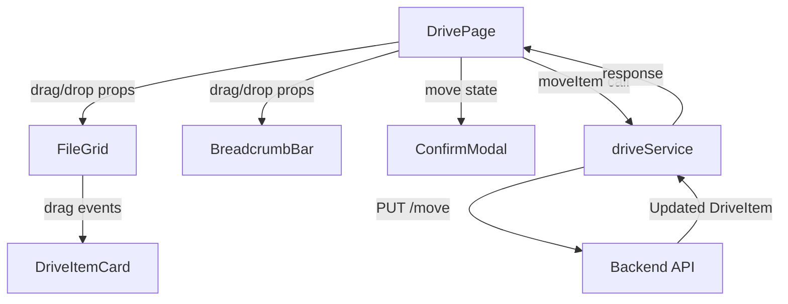

# Design Document: Drive File Move

## Overview

This feature adds drag-and-drop move functionality to the MyDrive page. Users can drag files and folders onto folder cards in the FileGrid or onto breadcrumb segments in the BreadcrumbBar to move items. A confirmation modal (reusing the existing ConfirmModal pattern) prompts before executing the move. The backend PUT endpoint `/users/{userId}/drives/{driveKey}/items/{itemId}/move` handles persistence, and the frontend updates local state using the response (which contains a new item ID since IDs are path-based).

The implementation uses the HTML5 Drag and Drop API natively — no additional libraries are needed. The existing component architecture (DrivePage as state owner, DriveItemCard/BreadcrumbBar as presentational) is preserved, with drag/drop event handlers threaded through props.

## Architecture

The feature follows the existing top-down data flow in the app:



DrivePage owns all drag-and-drop state: the current drag source, pending move confirmation, and error handling. It passes drag/drop event handler callbacks down to FileGrid, DriveItemCard, and BreadcrumbBar. When a valid drop occurs, DrivePage opens the ConfirmModal. On confirmation, it calls `driveService.moveItem()` and updates `driveData` state with the response.

### Key Design Decisions

1. **Reuse ConfirmModal** — The existing ConfirmModal component already handles overlay, Escape key, and button styling. We'll extend it with optional props (`title`, `message`, `confirmLabel`) to support both delete and move confirmation without duplicating the component.

2. **No drag state library** — The HTML5 Drag and Drop API is sufficient. We store the drag source ID/name in `dataTransfer` and track drag-over state locally in each potential drop target via component state.

3. **State lives in DrivePage** — Consistent with the existing pattern where DrivePage is the single source of truth for `driveData`, `currentFolderId`, and error state. The move operation follows the same optimistic-then-rollback pattern used by delete.

4. **Item ID changes after move** — The backend returns a new DriveItem with a different ID (path-based). The local state update must remove the old ID entry and insert the new one, updating both the old parent's and new parent's `children` arrays.

## Components and Interfaces

### driveService — new `moveItem` function

```js
/**
 * PUT /users/{userId}/drives/{driveKey}/items/{itemId}/move
 * @param {string} userId
 * @param {string} driveKey
 * @param {string} itemId - Current item ID
 * @param {string} parentId - Destination folder ID
 * @returns {Promise<DriveItem>} Updated item with new ID
 */
export async function moveItem(userId, driveKey, itemId, parentId) {
  return apiClient.put(
    `/users/${userId}/drives/${driveKey}/items/${itemId}/move`,
    { parentId }
  );
}
```

### DriveItemCard — drag source + drop target props

New props added to DriveItemCard:

```js
{
  draggable: boolean,          // true when not mediaCache
  onDragStart: (e) => void,    // sets dataTransfer with item ID/name
  onDragOver: (e) => void,     // highlights if folder & not self
  onDragLeave: (e) => void,    // removes highlight
  onDrop: (e) => void,         // triggers move confirmation
  isDragOver: boolean,         // controls highlight CSS class
  isDragging: boolean,         // controls dimmed CSS class
}
```

### BreadcrumbBar — drop target props

New props added to BreadcrumbBar:

```js
{
  onSegmentDragOver: (e, segmentId) => void,
  onSegmentDragLeave: (e) => void,
  onSegmentDrop: (e, segmentId, segmentName) => void,
  dragOverSegmentId: string | null,  // which segment is highlighted
  isMediaCache: boolean,             // disables drop when true
}
```

### ConfirmModal — generalized props

Extend the existing ConfirmModal to support move confirmation:

```js
{
  isOpen: boolean,
  title: string,           // "Confirm Delete" or "Confirm Move"
  message: ReactNode,      // flexible message content
  confirmLabel: string,    // "Delete" or "Yes"
  onConfirm: () => void,
  onCancel: () => void,
}
```

The existing delete usage passes `title="Confirm Delete"`, `confirmLabel="Delete"`. The move usage passes `title="Confirm Move"`, `confirmLabel="Yes"`.

### DrivePage — new state and handlers

New state variables:

```js
const [dragSourceId, setDragSourceId] = useState(null);
const [moveConfirm, setMoveConfirm] = useState(null);
// moveConfirm shape: { itemId, itemName, destinationId, destinationName }
```

New handler functions:

- `handleDragStart(e, itemId)` — Sets `dragSourceId`, writes item ID/name to `e.dataTransfer`
- `handleDragEnd()` — Clears `dragSourceId`
- `handleDropOnFolder(itemId, folderName)` — Validates drop, sets `moveConfirm`
- `handleDropOnBreadcrumb(segmentId, segmentName)` — Validates drop, sets `moveConfirm`
- `confirmMove()` — Calls `driveService.moveItem()`, updates `driveData`, handles errors
- `cancelMove()` — Clears `moveConfirm`

### FileGrid — threading drag props

FileGrid receives `dragSourceId`, `isMediaCache`, and the drag handler callbacks from DrivePage, and passes them through to each DriveItemCard. It also manages per-card `dragOverItemId` state to track which folder card is currently highlighted.

## Data Models

### DriveItem (existing, unchanged)

```js
{
  id: string,           // path-based, changes on move
  name: string,
  type: "file" | "folder",
  fileType: string,     // extension for files
  parentId: string,     // parent folder ID
  children: string[],   // child IDs (folders only)
  color: string,        // folder color (folders only)
  size: string,         // human-readable size (files only)
}
```

### Move API Request

```js
PUT /users/{userId}/drives/{driveKey}/items/{itemId}/move
Content-Type: application/json

{ "parentId": "<destination folder ID>" }
```

### Move API Response

```js
// 200 OK
{
  id: string,           // NEW path-based ID
  name: string,
  type: "file" | "folder",
  parentId: string,     // destination folder ID
  children: string[],   // (folders only, IDs may also change)
  // ... other fields
}
```

### Move Confirmation State

```js
{
  itemId: string,            // source item's current ID
  itemName: string,          // source item's display name
  destinationId: string,     // target folder ID
  destinationName: string,   // target folder display name
}
```

### Local State Update Flow (on success)

1. Remove `oldItemId` from `driveData[oldParentId].children`
2. Delete `driveData[oldItemId]` entry (and descendants if folder)
3. Add `newItem.id` to `driveData[destinationId].children`
4. Set `driveData[newItem.id] = newItem` (and re-insert descendants with updated IDs if folder)
5. If `currentFolderId` was a descendant of the moved folder, navigate to the nearest valid ancestor

### Error Code to Message Mapping

| Status | Message |
|--------|---------|
| 404 | "This item no longer exists." (+ refresh) |
| 409 | "An item with that name already exists in the destination folder, or the move would create a circular reference." |
| 400 | "The root folder cannot be moved." |
| 403 | "You do not have permission to move this item." |


## Correctness Properties

*A property is a characteristic or behavior that should hold true across all valid executions of a system — essentially, a formal statement about what the system should do. Properties serve as the bridge between human-readable specifications and machine-verifiable correctness guarantees.*

### Property 1: Valid drop opens modal with correct names

*For any* drag source item and *for any* valid drop target (a folder card that is not the drag source, or a non-current breadcrumb segment), dropping the source onto the target should open the Move Confirmation Modal displaying the source item's name and the target folder's name.

**Validates: Requirements 1.3, 2.2**

### Property 2: Invalid drop is a no-op

*For any* drag source item and *for any* invalid drop target (a file card, empty space, the drag source itself, or the current-folder breadcrumb segment), dropping the source should not change the drive data state and should not open the Move Confirmation Modal.

**Validates: Requirements 1.5, 1.6, 2.3**

### Property 3: Confirmed move calls correct API endpoint

*For any* confirmed move with source item ID `itemId` and destination folder ID `parentId`, the system should send a PUT request to `/users/{userId}/drives/{driveKey}/items/{itemId}/move` with body `{ "parentId": parentId }`.

**Validates: Requirements 3.2, 4.1**

### Property 4: Cancel leaves state unchanged

*For any* pending move confirmation, clicking Cancel or pressing Escape should close the modal and leave the drive data state identical to what it was before the modal opened.

**Validates: Requirements 3.3, 3.4**

### Property 5: Successful move updates local state correctly

*For any* successful move response containing a new DriveItem, the local drive data should satisfy all of: (a) the old item ID is removed from the old parent's children array, (b) the new item ID is present in the destination folder's children array, (c) `driveData[newId]` equals the returned item, and (d) `driveData[oldId]` no longer exists.

**Validates: Requirements 4.2**

### Property 6: Error status codes map to correct messages

*For any* move API error with status code in {400, 403, 404, 409}, the displayed error message should match the corresponding message defined in the requirements. Additionally, a 404 error should trigger a drive contents refresh.

**Validates: Requirements 4.3, 4.4, 4.5, 4.6**

### Property 7: MediaCache disables all drag-and-drop

*For any* drive state where `activeDrive` is `"mediaCache"`, no item should be draggable, no folder card should accept drops, and no breadcrumb segment should accept drops.

**Validates: Requirements 5.1, 5.2, 5.3**

### Property 8: Modal displays correct message format

*For any* item name and destination folder name, the Move Confirmation Modal should display the message "Are you sure you want to move {item name} to {destination folder name}?".

**Validates: Requirements 3.1**

## Error Handling

### API Error Handling

The `confirmMove` handler wraps the `driveService.moveItem()` call in a try/catch and maps error status codes to user-facing messages:

| Status | Error Code | User Message | Additional Action |
|--------|-----------|--------------|-------------------|
| 404 | DRIVE_ITEM_NOT_FOUND | "This item no longer exists." | Call `refreshDriveContents()` |
| 409 | DRIVE_ITEM_CONFLICT | "An item with that name already exists in the destination folder, or the move would create a circular reference." | None |
| 400 | DRIVE_ROOT_MOVE | "The root folder cannot be moved." | None |
| 403 | DRIVE_ACCESS_DENIED | "You do not have permission to move this item." | None |
| Other | — | `driveService.getErrorMessage(err)` fallback | None |

Error messages are displayed via the existing `error` state and `<p className={styles.errorText}>` element already in DrivePage.

### Drag-and-Drop Edge Cases

- **Drag source no longer exists**: If `driveData[dragSourceId]` is falsy when the drop occurs, the drop is silently ignored.
- **Drop target no longer exists**: If `driveData[destinationId]` is falsy when the drop occurs, the drop is silently ignored.
- **Concurrent operations**: If a delete or other operation removes the item while the modal is open, `confirmMove` checks that the item still exists before calling the API. If not, it clears the modal and refreshes.
- **Folder moved while viewing descendant**: After a successful move, if `currentFolderId` is no longer present in `driveData`, navigate to the moved folder's old parent (or root as fallback) using `buildBreadcrumbPath`.

### Permission Guard

All drag-and-drop interactions are gated on `!isMediaCache` at the DrivePage level. The `draggable` attribute on DriveItemCard is set to `false` when `isMediaCache` is true. BreadcrumbBar drop handlers are not attached when `isMediaCache` is true.

## Testing Strategy

This project does not use a testing framework (intentional project decision). Correctness is verified through:

- **Manual testing**: Drag-and-drop interactions across folder cards and breadcrumb segments, modal confirmation/cancellation, error scenarios (simulated via network throttling or backend manipulation), and mediaCache permission enforcement.
- **Code review**: Ensuring the local state update logic correctly handles ID changes, parent/child array mutations, and navigation adjustments.
- **Browser DevTools**: Monitoring network requests to verify correct API calls (PUT method, URL pattern, request body), and inspecting React state to confirm local data consistency after moves.
- **The correctness properties above** serve as a formal checklist for manual verification — each property describes an invariant that should hold during any manual test pass.
