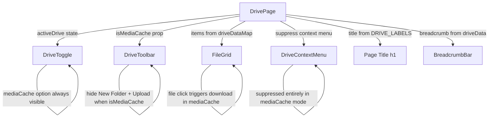

# Design Document: Media Cache Drive

## Overview

The Media Cache Drive feature adds a read-only drive option to the existing drive page. Users can switch to "Media Cache" via the toggle row, browse folders, and download files — but cannot upload, create folders, delete items, or change folder colors. The implementation follows the same patterns already established by the existing drives (My Drive, Shared Drive, Admin Drive), extending the toggle, data map, toolbar, context menu, and file grid with a conditional read-only mode keyed off `activeDrive === "mediaCache"`.

The core design principle is minimal invasiveness: rather than introducing a new permissions system or read-only abstraction layer, each component receives an `isReadOnly` (or equivalent) prop derived from the active drive, and conditionally hides or disables its write-oriented UI elements.

## Architecture

The feature integrates into the existing component tree without introducing new components or layers. The drive page (`DrivePage`) already manages drive selection, data routing, and action dispatch. The Media Cache drive slots into this architecture as a new entry in the drive data map and toggle options.



### Data Flow

1. User clicks "Media Cache" in `DriveToggle` → calls `switchDrive("mediaCache")`
2. `DrivePage` sets `activeDrive` to `"mediaCache"`, resets `currentFolderId` to `"root"`, rebuilds breadcrumb from `mediaCacheDriveData`
3. `DrivePage` derives `isMediaCache = activeDrive === "mediaCache"` and passes it to child components
4. `DriveToolbar` hides "New Folder" and "Upload File" buttons when `isMediaCache` is true
5. `FileGrid` suppresses `newFolderMode` rendering when `isMediaCache` is true; file clicks trigger download instead of no-op
6. `DrivePage` suppresses context menu entirely when `isMediaCache` is true (no right-click menu appears)
7. Page title renders from `DRIVE_LABELS["mediaCache"]` → `"Media Cache"`

## Components and Interfaces

### DrivePage (`src/app/drive/page.js`)

Changes:
- Import `mediaCacheDriveData` from `data/driveData.js`
- Add `"mediaCache"` entry to initial `driveDataMap` state
- Add `"mediaCache": "Media Cache"` to `DRIVE_LABELS`
- Derive `const isMediaCache = activeDrive === "mediaCache"`
- Guard `setNewFolderMode(true)` calls: no-op when `isMediaCache`
- Guard `handleContextMenu`: no-op when `isMediaCache`
- Pass `isMediaCache` to `DriveToolbar` and `FileGrid`
- For file clicks in media cache mode, trigger a download action

```js
// New constant addition
const DRIVE_LABELS = {
  myDrive: "My Drive",
  sharedDrive: "Shared Drive",
  adminDrive: "Admin Drive",
  mediaCache: "Media Cache",
};

// New state initialization
const [driveDataMap, setDriveDataMap] = useState({
  myDrive: myDriveData,
  sharedDrive: sharedDriveData,
  adminDrive: adminDriveData,
  mediaCache: mediaCacheDriveData,
});

// Derived flag
const isMediaCache = activeDrive === "mediaCache";
```

### DriveToggle (`components/DriveToggle.js`)

Changes:
- Add `{ key: "mediaCache", label: "Media Cache" }` to `DRIVE_OPTIONS`
- The "Media Cache" option is always visible (not gated by `showAdminDrive`), so the filter logic only removes `adminDrive` for non-admins

```js
const DRIVE_OPTIONS = [
  { key: "myDrive", label: "My Drive" },
  { key: "sharedDrive", label: "Shared Drive" },
  { key: "adminDrive", label: "Admin Drive" },
  { key: "mediaCache", label: "Media Cache" },
];

// Filter only removes adminDrive, mediaCache always shown
const drives = showAdminDrive
  ? DRIVE_OPTIONS
  : DRIVE_OPTIONS.filter((d) => d.key !== "adminDrive");
```

### DriveToolbar (`components/DriveToolbar.js`)

Changes:
- Accept new `isMediaCache` prop
- Conditionally hide "New Folder" and "Upload File" buttons when `isMediaCache` is true
- "Upload Video to Plex" button is also hidden in media cache mode (it's an upload action)

```js
export default function DriveToolbar({ onNewFolder, onUploadFile, onPlexUpload, isMediaCache = false }) {
  if (isMediaCache) {
    return (
      <div className={styles.toolbar} role="toolbar" aria-label="Drive actions">
        {/* All action buttons hidden in read-only media cache mode */}
      </div>
    );
  }
  // ... existing render
}
```

### FileGrid (`components/FileGrid.js`)

Changes:
- Accept new `isMediaCache` prop
- Suppress `newFolderMode` rendering when `isMediaCache` is true
- Pass `isMediaCache` context to item click handling (file clicks trigger download)

```js
export default function FileGrid({
  items,
  onFolderClick,
  onFileClick,
  onContextMenu,
  newFolderMode,
  onNewFolderSubmit,
  onNewFolderCancel,
  isMediaCache = false,
}) {
  // newFolderMode rendering suppressed when isMediaCache
  const showNewFolder = newFolderMode && !isMediaCache;
  // ...
}
```

### DriveItemCard (`components/DriveItemCard.js`)

No changes needed. The `onClick` prop is already conditionally set by `FileGrid`/`DrivePage`. For media cache file items, the parent will pass a download handler as `onClick`.

### DriveContextMenu (`components/DriveContextMenu.js`)

No changes needed to the component itself. The `DrivePage` will simply not render the context menu when `isMediaCache` is true by guarding the `handleContextMenu` function.

### BreadcrumbBar (`components/BreadcrumbBar.js`)

No changes needed. Breadcrumb navigation works identically for all drives since it reads from the active drive's data via `buildBreadcrumbPath`.

## Data Models

### Media Cache Drive Data (`data/driveData.js`)

A new exported constant `mediaCacheDriveData` using the identical structure as existing drives:

```js
export const mediaCacheDriveData = {
  "root": {
    id: "root",
    name: "Media Cache",
    type: "folder",
    fileType: null,
    size: null,
    color: null,
    children: ["mc-folder-movies", "mc-folder-music", "mc-folder-images", "mc-file-readme"],
    parentId: null,
  },
  // ... child folders and files following the same schema
};
```

Each item conforms to the existing schema:

| Field      | Type              | Description                                    |
|------------|-------------------|------------------------------------------------|
| `id`       | `string`          | Unique identifier                              |
| `name`     | `string`          | Display name                                   |
| `type`     | `"folder"\|"file"`| Item type                                      |
| `fileType` | `string\|null`    | File extension (null for folders)               |
| `size`     | `string\|null`    | Human-readable size (null for folders)          |
| `color`    | `string\|null`    | Folder color hex (null for files)               |
| `children` | `string[]`        | Child item IDs (empty array for files)          |
| `parentId` | `string\|null`    | Parent folder ID (null for root)                |

No new fields are introduced. The media cache data is static and read-only by convention — the `DrivePage` enforces read-only behavior through UI guards, not through data-level restrictions.


## Correctness Properties

*A property is a characteristic or behavior that should hold true across all valid executions of a system — essentially, a formal statement about what the system should do. Properties serve as the bridge between human-readable specifications and machine-verifiable correctness guarantees.*

### Property 1: Media Cache data source routing

*For any* set of media cache drive data items, when `activeDrive` is `"mediaCache"`, the items displayed in the FileGrid should be exactly the children of the current folder in the `mediaCacheDriveData` source, and never items from any other drive's data source.

**Validates: Requirements 2.2**

### Property 2: Media Cache data structure conformance

*For any* item in the `mediaCacheDriveData` object, it must contain all required fields (`id`, `name`, `type`, `fileType`, `size`, `color`, `children`, `parentId`) matching the same types used by existing drive data sources.

**Validates: Requirements 2.3**

### Property 3: Context menu suppression in Media Cache mode

*For any* item (file or folder) in the Media Cache drive, right-clicking should not produce a context menu. This covers both the "Delete" option being hidden for all items and the "Change Color" option being hidden for folders — since all actionable items are removed, the menu is suppressed entirely.

**Validates: Requirements 4.1, 4.2, 4.3**

### Property 4: File download availability in Media Cache mode

*For any* file item in the Media Cache drive, clicking the item should initiate a download action rather than being a no-op.

**Validates: Requirements 6.1**

### Property 5: Folder navigation in Media Cache mode

*For any* folder item in the Media Cache drive, clicking the folder should navigate into it (updating `currentFolderId` and breadcrumb path), preserving the same navigation behavior as other drives.

**Validates: Requirements 6.2**

### Property 6: Drive label title mapping

*For any* drive key in the `DRIVE_LABELS` map (including `"mediaCache"`), when that drive is active, the page title should display the corresponding label string.

**Validates: Requirements 7.1, 7.2**

## Error Handling

| Scenario | Handling |
|---|---|
| `mediaCacheDriveData` missing or malformed | The drive page will fail to render items. Since this is static data shipped with the app, this is caught during development. No runtime guard needed beyond the existing `filter(Boolean)` in `getCurrentItems()`. |
| User navigates to a non-existent folder ID in media cache | The existing `navigateToFolder` function falls back to `"root"` when the folder ID is not found in `driveData`. This behavior applies equally to the media cache drive. |
| Programmatic attempt to create folder in media cache mode | The `onNewFolder` handler in `DrivePage` will check `isMediaCache` and no-op. The `FileGrid` also suppresses the inline input rendering. Double guard ensures robustness. |
| Right-click in media cache mode | The `handleContextMenu` function in `DrivePage` will no-op when `isMediaCache` is true, so no context menu state is set and no menu renders. |
| Switching away from media cache | The existing `switchDrive` function resets `currentFolderId` to `"root"` and rebuilds breadcrumbs from the new drive's data. No special handling needed for leaving media cache mode. |

## Testing Strategy

> **Note:** This project intentionally does not use any testing framework. The correctness properties above serve as formal specifications for manual verification and code review. No automated tests, test files, or test dependencies should be created.

### Manual Verification Checklist

The following scenarios should be verified manually during development:

1. Toggle row displays "Media Cache" button for both admin and non-admin users
2. Clicking "Media Cache" switches to the media cache drive and shows its root contents
3. "New Folder" and "Upload File" buttons are hidden when media cache is active
4. Right-clicking any item in media cache mode does not show a context menu
5. Clicking a folder in media cache mode navigates into it with correct breadcrumb updates
6. Clicking a file in media cache mode triggers a download
7. Page title shows "Media Cache" when the media cache drive is active
8. Switching from media cache to another drive restores all toolbar buttons and context menu functionality
9. The breadcrumb "back" navigation works correctly within the media cache drive
